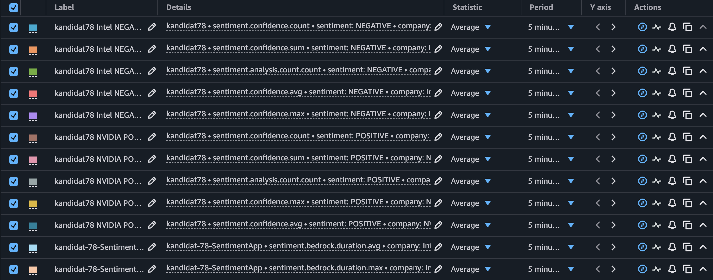
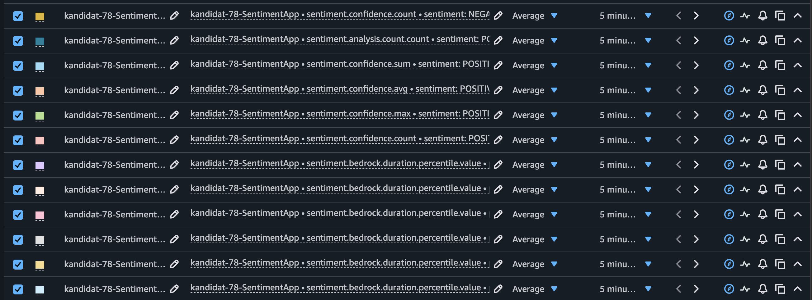
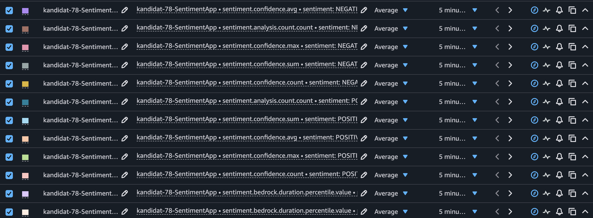
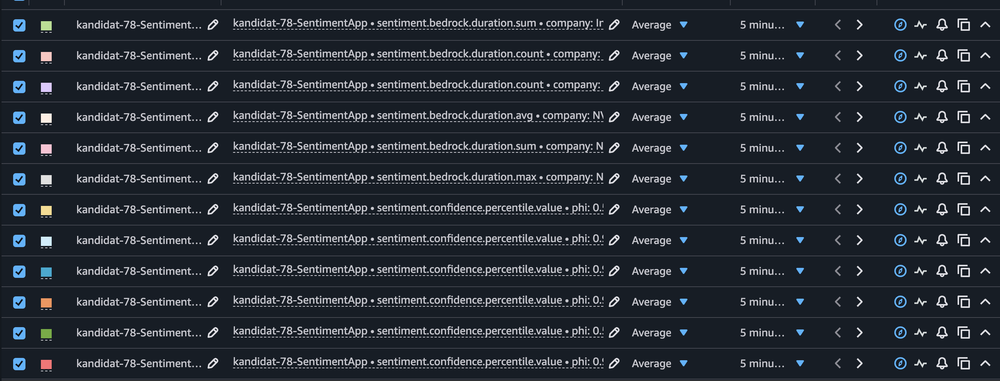
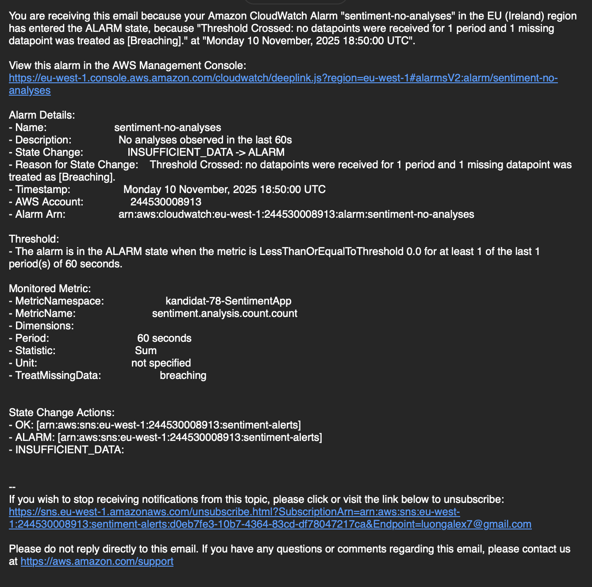
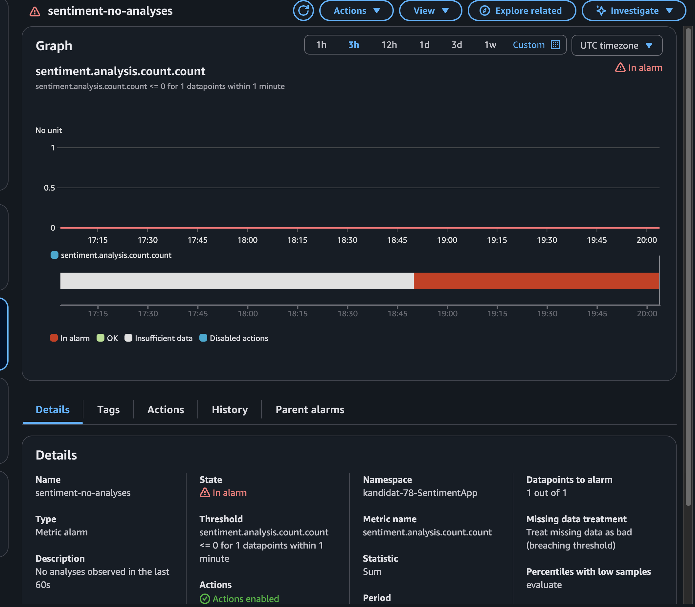
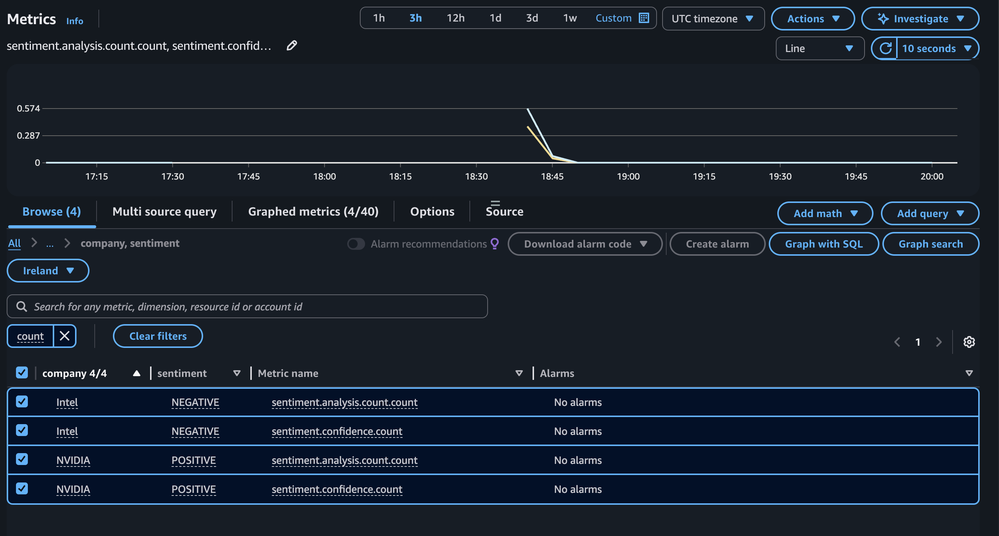

# Besvarelse kandidat 78

### Oppgave 2 Del 1
- Her er url fra sam: https://79ba8jc1jh.execute-api.eu-west-1.amazonaws.com/Prod/analyze/ 
- Her er s3 object: s3://kandidat-78-data/midlertidig/comprehend-20251107-225637-2718ec4f.json
### Oppgave 2 Del 2
- Her er linken til workflow filen: https://github.com/Theheavyduty/pgr301-eksamen-2025-main/actions/runs/19186132797/workflow
https://github.com/Theheavyduty/pgr301-eksamen-2025-main/blob/main/.github/workflows/sam-deploy.yml
- Her er linken til PR workflow builden: https://github.com/Theheavyduty/pgr301-eksamen-2025-main/actions/runs/19186132797/job/54852947170
- Instruks til sensor: 
    #### Før man følger instruksene så må man legge til secrets i github
    - AWS_ACCESS_KEY_ID
    - AWS_SECRET_ACCESS_KEY
    - AWS_REGION (eu-west-1)
    - KANDIDATNR
    #### Hvordan man kjører workflow PR
    1. Lag en ny branch
    2. Gå til den nye branchen git switch/git checkout
    3. Gjør en endring i workflow filen (sam-deploy.yml) det kan være hva som helst, f.eks kommentar på bunnen av filen
    4. Git add filene, commit og push endringen i den nye branchen
    5. Gå til github sin nettside og lag en PR, fra nye branchen til main. 
    6. Så merge og sjekk actions.
### Oppgave 3
- Her er linken til workflow filen: https://github.com/Theheavyduty/pgr301-eksamen-2025-main/blob/main/.github/workflows/docker-build.yml 
https://github.com/Theheavyduty/pgr301-eksamen-2025-main/actions/runs/19183325210/workflow
- Her er linken til workflow builden: https://github.com/Theheavyduty/pgr301-eksamen-2025-main/actions/runs/19183325210/job/54844867697
- Forklaring på tagging strategi:
    - Latest: Lett å trekke den siste image uten å huske en spesifikk version
    - sha-short: Sporbar peker på nøyaktig commit. Det gir reproducerbare deploys, enkel rollback og revisjonsspor
    - 
- Container image navn: theheavyduty/sentiment-docker
- Beskrivelse hvordan kjøre workflow:
    - Legg til github secrets
        - Docker username (DOCKER_USERNAME)
        - Docker token (DOCKER_TOKEN)
    - Gjør en endring i sentiment-docker f.eks legg til en enkel system print i [Application filen](sentiment-docker/src/main/java/com/aialpha/sentiment/SentimentDockerApplication.java), eller fjern det hvis det er en der fra før
    - Git add, commit og push endringen i main branch
    - Sjekk github actions

### Oppgave 4 Del 1
(Skjermbildene ligger i media mappen)

#### Timer (sentiment.bedrock.duration)

- Hvorfor Timer: Måler varighet med start/slutt og samler count/sum/max + (valgfritt) percentiler/histogram. Det passer perfekt til eksterne kall hvor vi vil følge p50/p90/p99 og alarmere når f.eks. p95 > 2s.

#### DistributionSummary (sentiment.confidence)

- Hvorfor DistributionSummary: Vi måler verdier, ikke tid – og vil se fordelingen av confidence (0.0–1.0). DistributionSummary gir count/sum/max og støtte for percentiler (de du ser som 0.5/0.9/0.99 i CloudWatch). Det gjør driftsovervåkning av kvalitet mulig (oppdage drift/bias).

#### Counter (sentiment.analysis.count.count)

- Hvorfor Counter: Teller hendelser som alltid øker – her: antall selskaper analysert, brutt ned per sentiment (og company). Dette gir oss throughput og gjør det enkelt å ta rater (per minutt) i CloudWatch.

#### Gauge (sentiment.companies.detected.last.value)

- Hvorfor Gauge: En tilstand som kan gå opp og ned – “hvor mange selskaper fant siste analyse?”. Counter passer ikke (den bare øker). Gauge viser raskt om parseren “faller av” (f.eks. plutselig 0).

### Oppgave 4 Del 2

(Skjermbildene ligger i media mappen)

### Oppgave 5
Innledning
Min vurdering er at KI-assistenter kan øke hastighet og kvalitet i DevOps—men bare når de kobles til gode praksiser for bygg, testing, observabilitet og governance. Uten den rammen skaper KI nye flaskehalser: svakt eierskap til kode, flere feil i produksjon og læring som “outsources” til modellen. Nedenfor drøfter jeg effektene på Flyt, Feedback og Kontinuerlig læring med eksempler fra arbeidet med Micrometer-metrikkene, CloudWatch-dashboard/alarmer og GitHub Actions-workflowene (Terraform/SAM).
1) Flyt (Flow)
Muligheter. KI reduserer ventetid i håndverket: scaffolding av Spring-endepunkter, Micrometer-instrumentering, Terraform-moduler og GitHub-workflows skjer på minutter, ikke timer. I oppgaven genererte vi raskt en SentimentMetrics med riktige instrumenter (Timer, Gauge, DistributionSummary) og en Terraform-pakke for dashboard + alarm. Slike aktiviteter er klassiske “lokale flaskehalser” som KI fjerner.
Nye flaskehalser. KI kan introdusere systemiske flaskehalser:

Uklare antagelser i generert kode (f.eks. feil metrikk-navn i CloudWatch eller for høy tag-kardinalitet) som må ryddes senere.

Pipeline-støy: flere PR-endringer uten tilstrekkelig testdekning skaper kø i code review og mer “rework”.

Security/compliance: KI kan foreslå snarveier (hardkodede secrets, for brede IAM-policyer). Dette akselererer lokalt men bremser release.

Review og deploy-syklus. God flyt krever tydelige porter: i repoet skilte vi mellom plan på PR og apply på main, og krevde artifacts (tfplan) + logiske guard-conditions. KI kan hjelpe å skrive disse workflowene, men mennesket må forme portene. Oppsummert: KI øker hastigheten i bygging, mens menneskestyrte porter holder levering trygg og forutsigbar.
2) Feedback
Tilpasning av feedback-sløyfer. Når kode er delvis KI-generert, må feedback gå raskt fra runtime tilbake til koden. Vi instrumenterte med:

Timer for Bedrock-latens (p50/p90/p99 mulig),

DistributionSummary for confidence-fordeling,

Gauge for “sist antall selskaper”,

Counter per sentiment/selskap.

I CloudWatch opprettet vi dashboard og alarm (f.eks. “latens > 5s” eller “ingen analyser siste 60s”). Da fikk vi umiddelbar tilbakemelding når noe var galt—inkludert meta-læring, som at Gauges publiseres som *.value og at “treat_missing_data = breaching” kan trigge alarm ved datastillhet. Slik feedback korrigerer KI-antagelser i praksis.
Rolle til test/overvåkning. Med KI må vi anta høyere risiko for feil og skrive mer automatisk test og mer observabilitet:

Kontraktstester og statisk analyse (f.eks. feil ved for brede AWS-policyer).

Synthetic checks/helseendepunkt for å se “lever koden” og pipelines som nekter å deploye ved røde tester.

Metrikk-styrt feedback: vi så tydelig hva som gikk i alarm og hvorfor (f.eks. fravær av datapunkter).

Læring fra feil. Når alarmer fyrer (som “no analyses”), dokumenterer vi årsaken (manglende trafikk, feil i paths, region-mismatch) og justerer terskler/perioder. KI kan foreslå årsaker, men teamet må validere mot telemetri.
3) Kontinuerlig læring og forbedring
Utviklerlæring. KI fungerer som parprogrammerer og accelererer onboarding. I oppgaven ga den rask tilgang til Micrometer/CloudWatch-mønstre og Terraform-syntaks. Risikoen er deskilling: hvis utviklere alltid spør KI, svekkes dypforståelsen av latency-semantikk, histogrammer og alarmtuning.
Beskytte dybdekompetanse.

Review med forklaring: Når KI foreslår en løsning, krever vi i PR-beskrivelsen begrunnelse (hvorfor Timer vs. LongTaskTimer, hvorfor Average vs. percentiler).

ADR-er (Architecture Decision Records) på viktige valg (navn, tags, terskler) gjør at kunnskap beholdes i repoet, ikke i en chatlogg.

Observability-drevet retros: bruk dashboard/alarmer til å evaluere endringer (“ble p95 bedre?”), ikke kun subjektive inntrykk.

Nye ferdigheter. Team må mestre:

Prompt-ingeniørkunst + kritisk lesing av forslag.

Observability-design (hvilke metrikker, hvilke tags, hvordan alarms settes).

Policy as code (branch-beskyttelse, deploy guards) for å temme rask KI-generert endringstakt.

Data hygiene (unngå å lekke proprietær konfig i prompts).

Konklusjon
KI skyver DevOps i retning høyere flyt—raskere scaffolding og færre lokale flaskehalser—men trygt tempo forutsetter gode feedback-sløyfer (test, observability, alarms) og bevisst læring (review, ADR, retros). I praksis fungerte dette best da vi kombinerte KI-generert instrumentering (Micrometer), målinger i CloudWatch og slueseporter i CI/CD (plan vs. apply). Min subjektive konklusjon: bruk KI aggressivt til å produsere førsteutkast og repetitivt arbeid, men la DevOps-prinsippene være rammen som former hva som faktisk slippes til produksjon—og hva teamet lærer av etterpå.